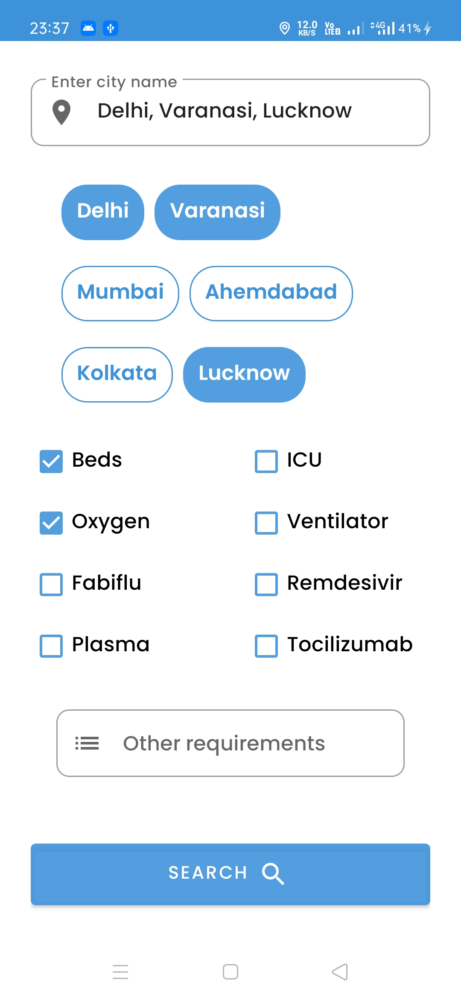
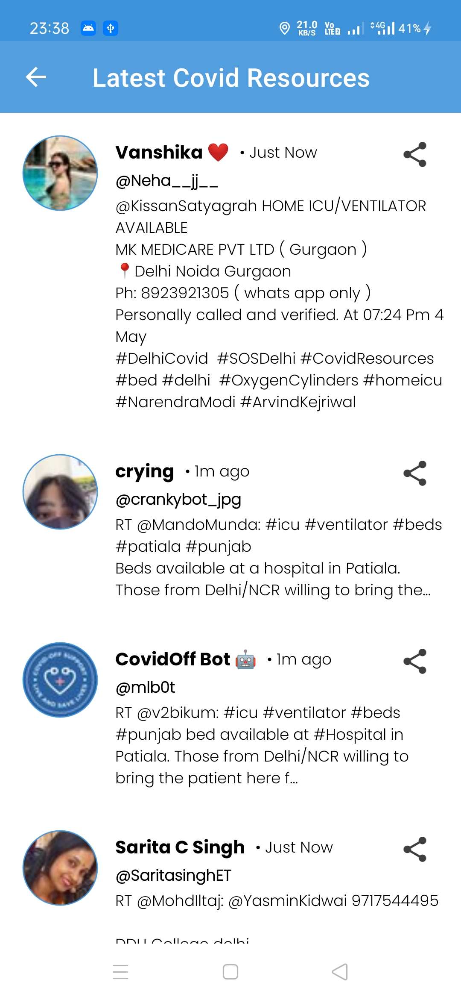

# Covid Resources App
 

**Covid Resources App** is an app which fetches latest data from twitter about the covid resources like **Oxygen**, **Ventilators** etc . Feel free to use it in your projects.

## About
It has two screens - **Search Screen** & **Resources Screen**. On search screen, users can search for required resources and on other screen, the list will show up. Users can easily share using other apps, 
tap on user profiles to directly message the owner of the tweet and also copy paste all data from the app.

## Built With 🛠
- [Twitter Api](https://developer.twitter.com/en/docs/twitter-api/tweets/search/quick-start/recent-search)
- [Kotlin](https://kotlinlang.org/)
- [RxJava](https://github.com/ReactiveX/RxKotlin)
- [Android Architecture Components](https://developer.android.com/topic/libraries/architecture)
  - [ViewModel](https://developer.android.com/topic/libraries/architecture/viewmodel)
   [Dependency Injection](https://developer.android.com/training/dependency-injection) 
  - [Hilt-Dagger](https://dagger.dev/hilt/)
  - [Hilt-ViewModel](https://developer.android.com/training/dependency-injection/hilt-jetpack)
- [Retrofit](https://square.github.io/retrofit/)
- [Material Components for Android](https://github.com/material-components/material-components-android)


## Architecture
This app uses [***MVVM (Model View View-Model)***](https://developer.android.com/jetpack/docs/guide#recommended-app-arch) architecture.


## Contribute
If you want to contribute to this library, you're always welcome!
See [Contributing Guidelines](CONTRIBUTING.md). 

## Contact
Drop your queries on my [Linkedin](https://www.linkedin.com/in/prashantappdeveloper).

## License
```
MIT License

Copyright (c) 2020 Prashant Singh

Permission is hereby granted, free of charge, to any person obtaining a copy
of this software and associated documentation files (the "Software"), to deal
in the Software without restriction, including without limitation the rights
to use, copy, modify, merge, publish, distribute, sublicense, and/or sell
copies of the Software, and to permit persons to whom the Software is
furnished to do so, subject to the following conditions:

The above copyright notice and this permission notice shall be included in all
copies or substantial portions of the Software.

THE SOFTWARE IS PROVIDED "AS IS", WITHOUT WARRANTY OF ANY KIND, EXPRESS OR
IMPLIED, INCLUDING BUT NOT LIMITED TO THE WARRANTIES OF MERCHANTABILITY,
FITNESS FOR A PARTICULAR PURPOSE AND NONINFRINGEMENT. IN NO EVENT SHALL THE
AUTHORS OR COPYRIGHT HOLDERS BE LIABLE FOR ANY CLAIM, DAMAGES OR OTHER
LIABILITY, WHETHER IN AN ACTION OF CONTRACT, TORT OR OTHERWISE, ARISING FROM,
OUT OF OR IN CONNECTION WITH THE SOFTWARE OR THE USE OR OTHER DEALINGS IN THE
SOFTWARE.
```

